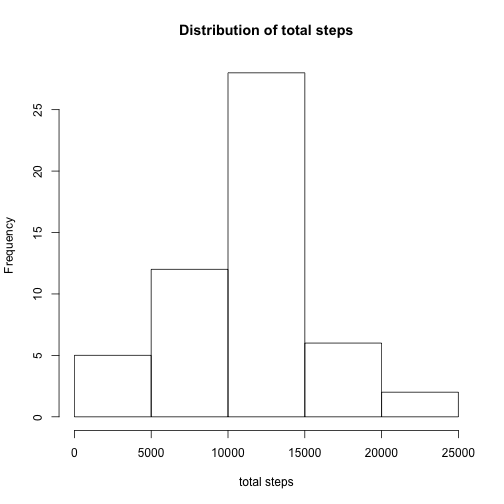
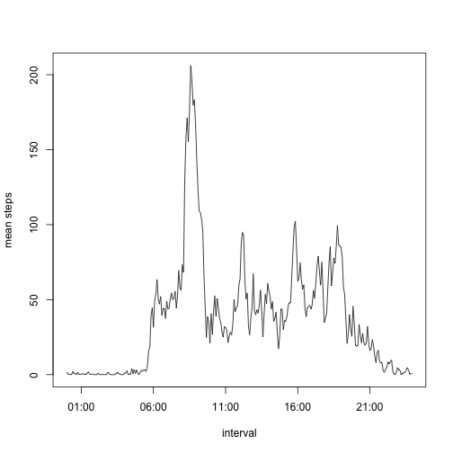
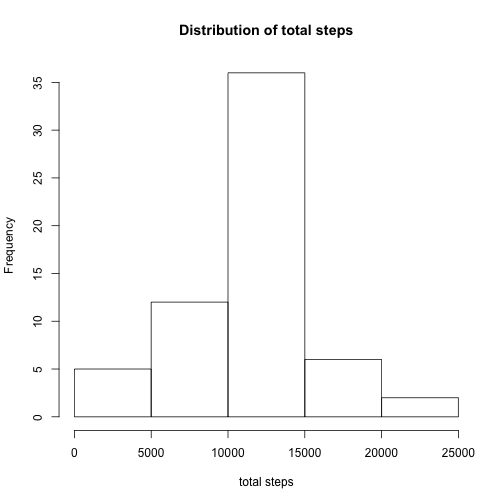
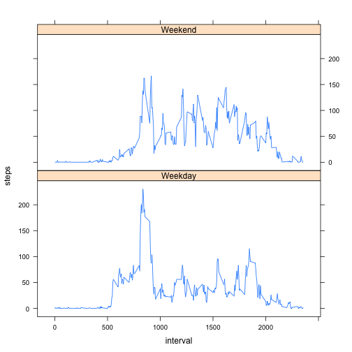

##Loading the data 

First, we read the data file and store it into "data".


```r
data<-read.csv("activity.csv")
```

```
## Warning in file(file, "rt"): cannot open file 'activity.csv': No such file
## or directory
```

```
## Error in file(file, "rt"): cannot open the connection
```

##Mean total number of steps taken per day

Let's calculate the total number of steps taken per day.

```r
total<-aggregate(steps~date,data,sum)
head(total,n=2)
```

```
##         date steps
## 1 2012-10-02   126
## 2 2012-10-03 11352
```

Now, let's draw a histogram of the total number of steps taken each day.

```r
with(total,hist(steps,main="Distribution of total steps",xlab="total steps"))
```

 

Let's calculate the mean and the median of the total number of steps taken per day.

```r
meanStep<-mean(total$steps,na.rm=TRUE)
medianStep<-median(total$steps,na.rm=TRUE)
meanStep<-format(round(meanStep, 2), nsmall = 2)
```
The mean is 10766.19 and the median is 10765.

##Average daily activity pattern

First, let's calculate the average number of steps taken in each interval

```r
meanInterval<-aggregate(steps~interval,data,mean)
head(meanInterval,n=2)
```

```
##   interval     steps
## 1        0 1.7169811
## 2        5 0.3396226
```

Let's convert intervals to time objects.

```r
meanInterval$interval <- strptime(sprintf("%04d", meanInterval$interval), format="%H%M")
```

Let's make a time series plot.

```r
with(meanInterval,plot(interval,steps,type="l",xlab="interval",ylab="mean steps"))
```

 

Let's find which interval contains the maximum number of steps on average.

```r
index<-which.max(meanInterval$steps)
maxInterval<- strftime(meanInterval[index,1], format="%H:%M")
maxInterval
```

```
## [1] "08:35"
```
This interval is then 08:35

##Imputing missing values
Let's calculate the number of missing values.

```r
miss<-sum(!complete.cases(data))
miss
```

```
## [1] 2304
```
The number of missing values is 2304

To fill in the missing values for an interval *I*, we use the mean for this interval.
For each row, if the step value is NA, we replace it by the mean steps for the corresponding interval.
The new dataset *data2* is equal to the original but with the missing data filled in.

```r
meanInterval<-aggregate(steps~interval,data,mean)
data2<-data
for(r in 1:dim(data2)[1]){
  if(is.na(data2[r,1])) data2[r,1]<-meanInterval$steps[meanInterval$interval==data2[r,3]]
}
head(data2,n=3)
```

```
##       steps       date interval
## 1 1.7169811 2012-10-01        0
## 2 0.3396226 2012-10-01        5
## 3 0.1320755 2012-10-01       10
```

Let's calculate the total number of steps taken per day.

```r
total2<-aggregate(steps~date,data2,sum)
head(total2,n=2)
```

```
##         date    steps
## 1 2012-10-01 10766.19
## 2 2012-10-02   126.00
```

Now, let's draw a histogram of the total number of steps taken each day.

```r
with(total2,hist(total2[,2],main="Distribution of total steps",xlab="total steps"))
```

 
Let's calculate the mean and the median of the total number of steps taken per day.

```r
meanStep<-mean(total2[,2],na.rm=TRUE)
medianStep<-median(total2[,2],na.rm=TRUE)
meanStep<-format(round(meanStep, 2), nsmall = 2)
medianStep<-format(round(medianStep, 2), nsmall = 2)
```
The mean is 10766.19 and the median is 10766.19.
The impact of adding the new values depend on the strategy used to add them. For the first part, the aggregate method removes these values.As we add the mean of an interval to replace missing values, the final mean of this interval doesn't change and so does the total mean. If we used for example tapply() in the first part, which includes the missing values in its computation (unlike aggregate()), we would observe a change in the mean. 
The median moved slightly.


##Weekdays vs weekends

We add a day type (weekday or weekend) column. 

```r
data2$date <- strptime(data2$date,format="%Y-%m-%d")
data2<-cbind(data2,dayType=data2$date)
data2$dayType<-ifelse(weekdays(data2$dayType)=="Sunday"|weekdays(data2$dayType)=="Saturday","Weekend","Weekday")
head(data2,n=2)
```

```
##       steps       date interval dayType
## 1 1.7169811 2012-10-01        0 Weekday
## 2 0.3396226 2012-10-01        5 Weekday
```

Let's make a plot panel of the intervals and steps taken averaged across weekdays or weekend days. We use the lattice library.

```r
plotData<-aggregate(steps~interval+dayType,data2,mean)
library(lattice)
xyplot(steps~interval|dayType,data=plotData,layout=c(1,2),type="l")
```

 

